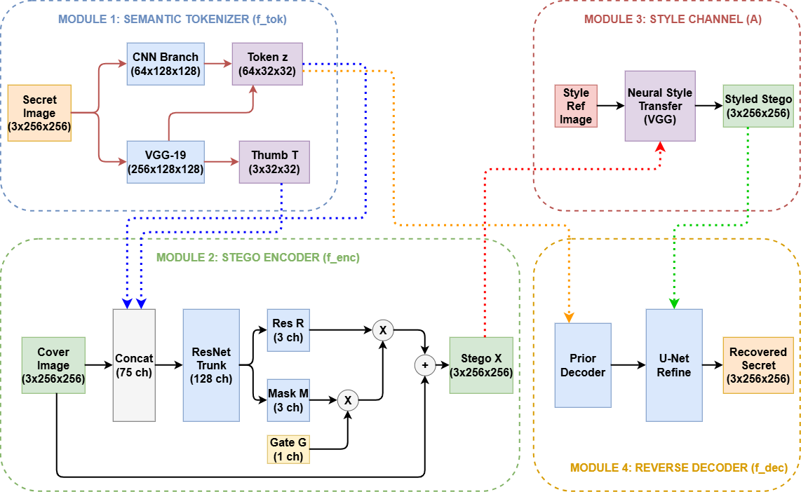

# Frequency-Guided Semantic Steganography (FGSS)

Official source code and benchmark results for:
> **Frequency-Guided Semantic Steganography for High-Fidelity Self-Contained Style-Transfer Image Hiding**  
> *The 4th International Conference on Intelligent Systems and Data Science (ISDS 2026)*  
> Published in Springer Communications in Computer and Information Science (CCIS).

---

## 📌 Overview

**Frequency-Guided Semantic Steganography (FGSS)** is a high-fidelity, self-contained steganographic framework for image hiding across artistic style-transfer channels. 

<p align="center">
  
</p>

### Key Innovations
1. **Semantic Secret Tokenisation**: Compact $64 \times 32 \times 32$ bottleneck representation paired with a structural thumbnail, slashing carrier spatial payload by $75\%$.
2. **Frequency-Guided Residual Energy Allocation**: Steers residual perturbation energy away from sensitive low-frequency smooth carriers into high-frequency artistic texture regions ($\boldsymbol{\Delta}_{\text{HH}}$) where human visual sensitivity is minimal.
3. **Nonlinear Capacity-Ceiling Soft Penalty**: Barrier objective calibrating residual energy against a target-derived distortion threshold, enforcing an empirical quality envelope without gradient saturation.
4. **Oracle Distillation & Serial Chaining**: Refinement U-Net decoder supervised by ideal secret tokens to ensure robust message recovery across sequential style re-applications.

---

## 📊 Headline Performance

Evaluated across **600 held-out evaluation pairs** from MS-COCO val2017:

| Metric | Baseline (Naive) | FGSS (Ours) | Gain / Difference |
| :--- | :---: | :---: | :---: |
| **Cover PSNR** | $32.66 \pm 0.54$\,dB | $\mathbf{39.61 \pm 0.35}$\,dB | $+6.95$\,dB |
| **Cover SSIM** | $0.942$ | $\mathbf{0.9914}$ | $+0.049$ |
| **Cover LPIPS** | $0.0682$ | $\mathbf{0.0195}$ | $-71.4\%$ perceptual distortion |
| **Clean Reverse SSIM** | $0.5234$ | $\mathbf{0.8070}$ | $+54.2\%$ structural fidelity |
| **Oracle Reverse SSIM** | --- | $\mathbf{0.8136}$ | Upper-bound diagnostic |
| **Embedding Latency** | --- | $\mathbf{< 0.010}$\,s | Real-time GPU execution |
| **Trainable Parameters** | --- | **10.68M** (1.92M embed) | Lightweight edge deployment |

---

## 📁 Repository Structure

```text
FGSS-ISDS2026/
├── checkpoints/                 # Pretrained model weights and loading guide
│   ├── benchmark_model_best.pt  # Official FGSS model weights (Epoch 39, 10.68M params)
│   └── README.md                # Checkpoint metadata, hashes, and loading snippet
├── paper_assets/                # Visual figures, curves, and evaluation grids
│   ├── architecture_diagram.png # Full modular system pipeline
│   ├── freq_decomp.jpg          # Haar wavelet frequency residual decomposition
│   ├── qualitative_grid.jpg     # Visual comparison across 4 benchmark domains
│   └── training_curve.png       # 41-epoch training trajectory across 3 phases
├── source_data/                 # Raw experimental outputs and CSV exports
│   ├── paper_table_main.csv     # Main comparison across reverse & serial settings
│   ├── run_summary.json         # Checkpoint logs, hyperparameters, and split info
│   ├── ablation.csv             # Single-pair and multi-epoch loss component sweep
│   ├── robustness_metrics.csv   # Per-attack distortion evaluation metrics
├── followup_results/            # Extended benchmark runs and steganalysis audits
│   ├── checkpoint_ablation_600_summary.json # 600-pair evolutionary checkpoint audit
│   ├── full_srm_steganalysis_summary.json   # 34,671-feature Spatial Rich Model probe
│   ├── neural_steganalysis_summary.json     # Xu-Net and SRNet detection ROC-AUC
│   └── gpu_runtime_256_summary.json         # Module-wise latency benchmarks
├── LICENSE                      # MIT License
└── README.md                    # Repository documentation
```

---

## 📜 Citation

If you find this work or benchmark useful in your research, please cite:

```bibtex
@inproceedings{pham2026fgss,
  author    = {Pham, Ngoc-Giau and Bui, Minh-Tuan and Vo, Phuoc-Hung},
  title     = {Frequency-Guided Semantic Steganography for High-Fidelity Self-Contained Style-Transfer Image Hiding},
  booktitle = {Proceedings of the 4th International Conference on Intelligent Systems and Data Science (ISDS 2026)},
  series    = {Communications in Computer and Information Science},
  publisher = {Springer},
  year      = {2026}
}
```

---

## 📄 License

This project is licensed under the MIT License - see the [LICENSE](LICENSE) file for details.